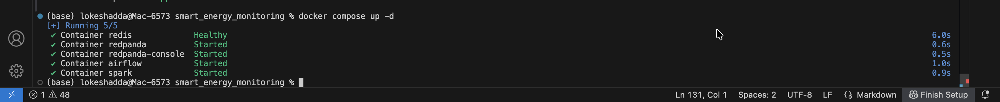
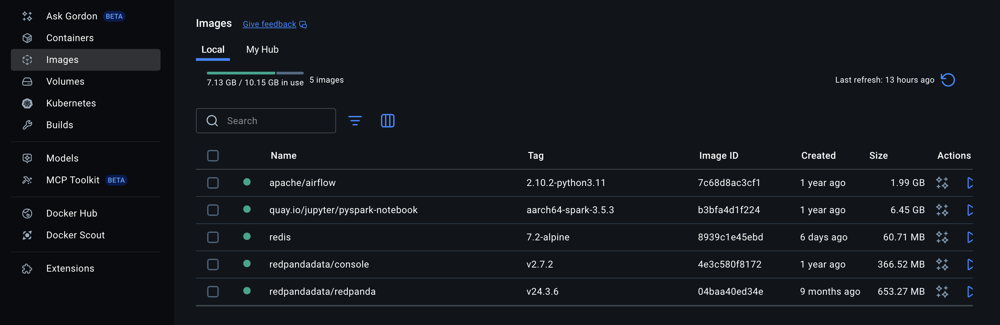
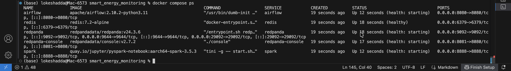
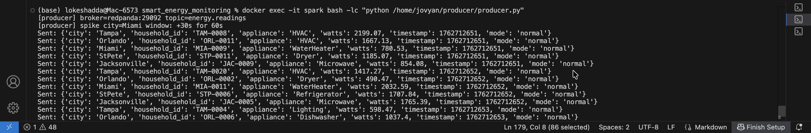
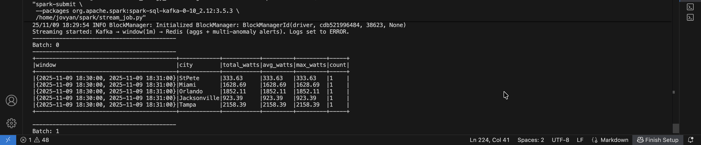
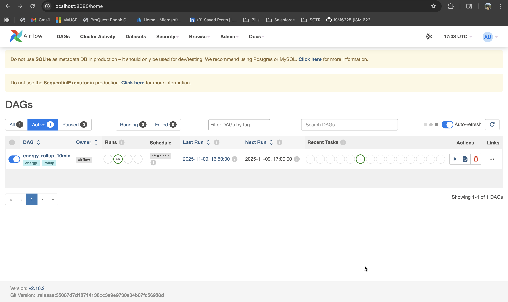
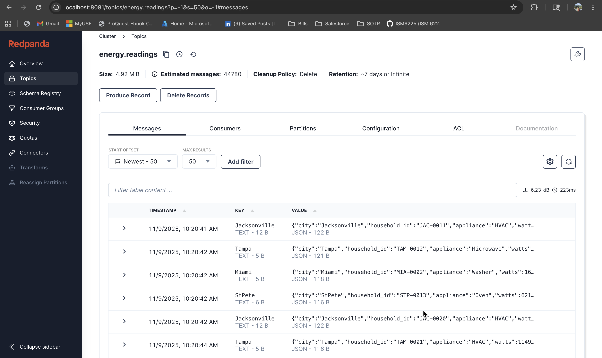

# Smart Energy Consumption Monitoring & Real-Time Anomaly Detection Pipeline


---

## Project Overview

This project implements a real-time smart energy monitoring and anomaly detection platform using Apache Spark Structured Streaming, Redpanda, Redis, Docker, and JupyterLab.

The platform simulates household smart-meter energy readings across multiple cities, processes streaming events in real time, detects abnormal energy consumption patterns, and visualizes operational insights through interactive dashboards.

The system demonstrates modern data engineering concepts including:
- Real-time event streaming
- Stateful stream processing
- Rolling window aggregations
- Automated anomaly detection
- Workflow orchestration
- Containerized deployment

---

## Key Features

- Real-time smart meter simulation
- Spark Structured Streaming pipeline
- Automated anomaly detection
- Redis-powered low-latency analytics storage
- Interactive dashboard visualization
- Docker-based deployment environment
- Airflow workflow orchestration
- Real-time streaming analytics

---

## Contributors

- Lokesh Adda
- Swetha Singireddy
- Raghu Ram Komara

---

## Technology Stack

| Category | Technologies |
|---|---|
| Programming Language | Python |
| Streaming Platform | Redpanda (Kafka API Compatible) |
| Stream Processing | Apache Spark Structured Streaming |
| Workflow Orchestration | Apache Airflow |
| Data Storage | Redis |
| Containerization | Docker & Docker Compose |
| Visualization | JupyterLab + Plotly |

---

## System Architecture

### Architecture Diagram

```text
┌───────────────────────┐     ┌────────────────────────┐     ┌────────────────────────────┐     ┌─────────────────────┐
│ Smart Meter Simulator │ --> │ Redpanda (Kafka Broker) │ --> │ Spark Structured Streaming │ --> │ Redis (KV Data Store)│
└───────────────────────┘     └────────────────────────┘     └────────────────────────────┘     └───────┬─────────────┘
                                                                                                         │
                                                                                                         ▼
                                                                                                JupyterLab Dashboard
```

---

## Platform Screenshots

### Docker Infrastructure

#### Docker Compose Initialization


#### Active Docker Containers


#### Docker Service Verification


---

### Streaming Pipeline

#### Smart Meter Producer Output


#### Spark Structured Streaming Logs


---

### Monitoring & Analytics

#### Airflow DAG Monitoring


#### Redpanda Streaming Console


---

## Architecture Components

| Component | Description |
|---|---|
| Smart Meter Simulator | Generates synthetic household energy readings across multiple cities |
| Redpanda | Kafka-compatible event streaming broker for real-time ingestion |
| Spark Structured Streaming | Performs rolling window aggregations and anomaly detection |
| Redis | Stores aggregated metrics and alert logs for real-time retrieval |
| Airflow | Orchestrates scheduled workflows and batch rollups |
| JupyterLab Dashboard | Provides real-time visualization and analytical insights |

---

## Real-World Application

Traditional utility monitoring systems often rely on delayed batch processing, preventing operators from detecting overloads and abnormal energy spikes in real time.

This platform enables:
- Real-time energy monitoring
- Immediate anomaly detection
- Operational analytics
- Grid load visibility
- Smart infrastructure monitoring

Potential industry use cases include:
- Smart city infrastructure
- Utility load balancing
- Power grid monitoring
- Predictive maintenance systems
- Household energy analytics

---

## Data Pipeline Workflow

1. Simulated smart meter readings are generated using Python  
2. Events are streamed into Redpanda topics  
3. Spark Structured Streaming processes incoming data in real time  
4. Rolling window aggregations identify abnormal consumption patterns  
5. Redis stores aggregated metrics and alerts  
6. JupyterLab dashboards visualize live operational insights  

---

## Anomaly Detection Logic

The platform detects three primary anomaly categories:

| Alert Type | Description |
|---|---|
| SPIKE | Sudden household-level watt surge |
| HIGH_AVG | Sustained elevated average energy usage |
| HIGH_TOTAL | Excessive city-wide energy load |

---

## Performance Metrics

| Metric | Value |
|---|---|
| End-to-End Latency | ~1–3 seconds |
| Streaming Throughput | ~3,000+ messages/minute |
| Processing Model | Real-Time Streaming |
| Fault Tolerance | Spark Checkpointing |
| Storage Type | In-Memory Redis Storage |

---

## Repository Structure

```text
smart-energy-monitoring-platform/
│
├── airflow/
│   └── dags/
│       └── energy_rollup_dag.py
│
├── images/
│   ├── docker_compose_up.png
│   ├── docker_desktop_containers.png
│   ├── docker_ps_output.png
│   ├── producer_output.png
│   ├── spark_streaming_logs.png
│   ├── energy.readings.png
│   └── energy_rollup_dag.png
│
├── notebooks/
│   └── energy_dashboard.ipynb
│
├── producer/
│   └── producer.py
│
├── spark/
│   ├── stream_job.py
│   └── batch_rollup.py
│
├── docker-compose.yml
├── requirements.txt
├── README.md
└── .gitignore
```

---

## Setup Instructions

### Clone Repository

```bash
git clone https://github.com/your-username/smart-energy-monitoring-platform.git
```

### Navigate to Project Directory

```bash
cd smart-energy-monitoring-platform
```

### Start Docker Services

```bash
docker compose up --build
```

### Start Producer

```bash
docker exec -it spark bash -lc "python /home/jovyan/producer/producer.py"
```

### Start Spark Streaming Job

```bash
docker exec -it spark bash -lc \
"spark-submit \
 --packages org.apache.spark:spark-sql-kafka-0-10_2.12:3.5.3 \
 /home/jovyan/spark/stream_job.py"
```

---

## Service Endpoints (During Deployment)

The following endpoints are available when the platform is deployed locally using Docker Compose:

| Service | URL |
|---|---|
| JupyterLab | http://localhost:8888 |
| Redpanda Console | http://localhost:8081 |
| Spark UI | http://localhost:4040 |
| Airflow UI | http://localhost:8080 |

---

## Business & Operational Impact

This platform demonstrates how streaming analytics can help utility providers:

- Detect abnormal consumption patterns early
- Reduce infrastructure overload risks
- Improve operational efficiency
- Optimize energy distribution planning
- Enable proactive grid management
- Support smart-city monitoring initiatives

---

## Future Enhancements

- Integrate Apache Kafka for large-scale distributed streaming
- Deploy pipelines on cloud infrastructure
- Implement real-time alert notification systems
- Add machine learning-based anomaly prediction
- Build advanced operational dashboards
- Integrate scalable distributed storage systems

---

## Author

### Lokesh Adda

Graduate Student in Business Analytics & Information Systems  
Focused on Data Analytics, Data Engineering, Machine Learning, and Data Governance.